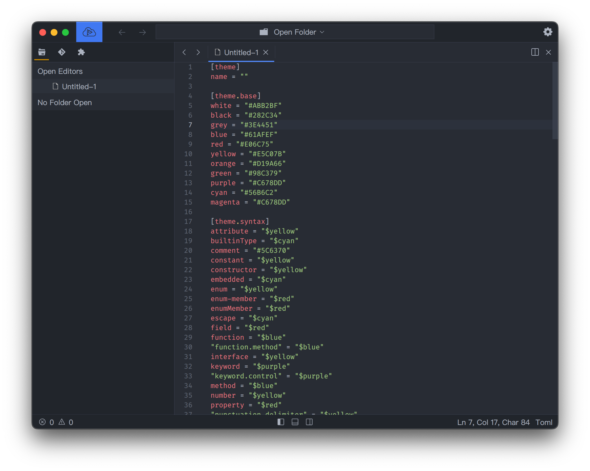

# Tema

Desarrollar un complemento de algún tema para Lapce es fácil. En primer lugar, [abra ajustes](../empezar/ajustes.md), y puede cambiar los colores en la `Theme settings`, y cambiar la apariencia de la interfaz en `UI settings`.&#x20;

<figure><figcaption></figcaption></figure>

[Abra la paleta de comandos](../empezar/paleta-de-comandos.md), elija el comando `Export current settings to a theme file`, esto debería generar el archivo del tema para usted.

<figure><figcaption></figcaption></figure>

Cambie el nombre del tema, y guarde el archivo.&#x20;

Para crear un plugin de tema para Lapce, siga el formato de este repositorio [https://github.com/lapce/atom-one](https://github.com/lapce/atom-one), los archivos importantes son `volt.toml` y el nombre del tema.&#x20;

Después de eso hecho, puede [publicarlo](plugins#Publicar-un-plugin).
