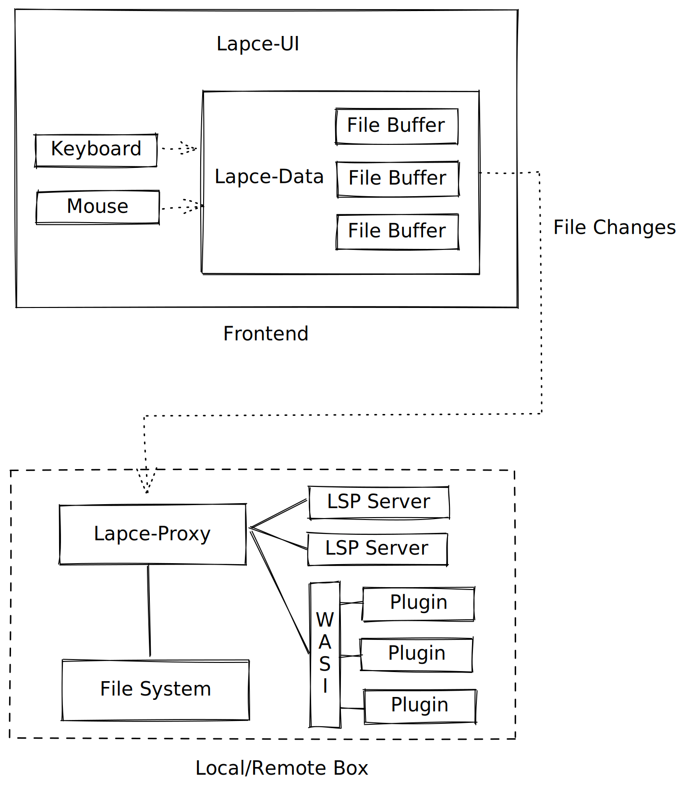

# Architecture

## Frontend

The frontend uses [Druid](https://github.com/linebender/druid) for the GUI of Lapce. Druid is a data first GUI framework. And all the state and logic are in `lapce-data` sub crate, e.g., file buffers, editor tabs, cursor, etc. The UI widgets tree, layout, and rendering logic are in `lapce-ui` sub crate, including all the UI related stuff, e.g., keyboard and mouse events, file dialogs, context menus etc.

## Proxy

The `lapce-proxy` sub crate provides the interface between the frontend, and the file system, plugins and lsp servers, so Lapce talks to files, plugins, lsp servers through the proxy. The reason for that is to provide the ability for remote development. In remote development mode, the `lapce-proxy` binary runs in the remote box, so that it can read files in the remote box, and the plugins and lsp servers can run in the remote box to utilise the power of the remote box.

## File Editing

Here is the flow of a typical file editing process. When you open a file in the GUI, `lapce-data` talks to `lapce-proxy` which reads the file from local disk and responds with the content of the file. `lapce-data` stores the file content locally. When `lapce-ui` receives a keyboard event, it modifies the file content in `lapce-data`, and only sends the change of that edit to `lapce-proxy.` `lapce-proxy` receives the change, and applies the change locally which make the file content in sync. When you save the file in the GUI, `lapce-data` sends the file save request to `lapce-proxy`, and `lapce-proxy` saves the file to the local disk.
