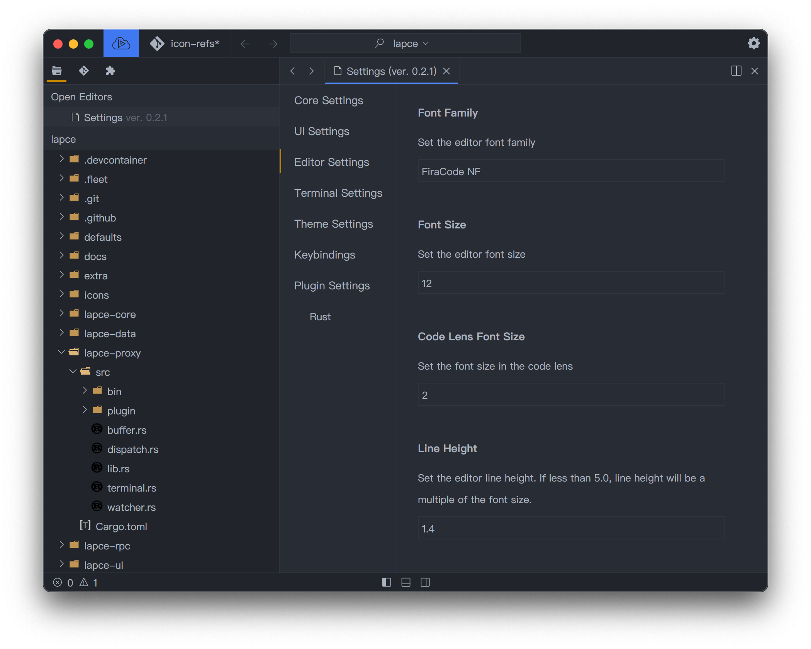

# Ajustes

Para ver los ajustes y hacer cambios en Lapce, haz click en el ícono de engranaje en la parte superior derecha para abrir el menú de ajustes.

<figure><figcaption></figcaption></figure>

Puede cambiar el nombre de la fuente, tamaño y más ajustes en la configuración principal y la configuración del editor

<figure><figcaption></figcaption></figure>

