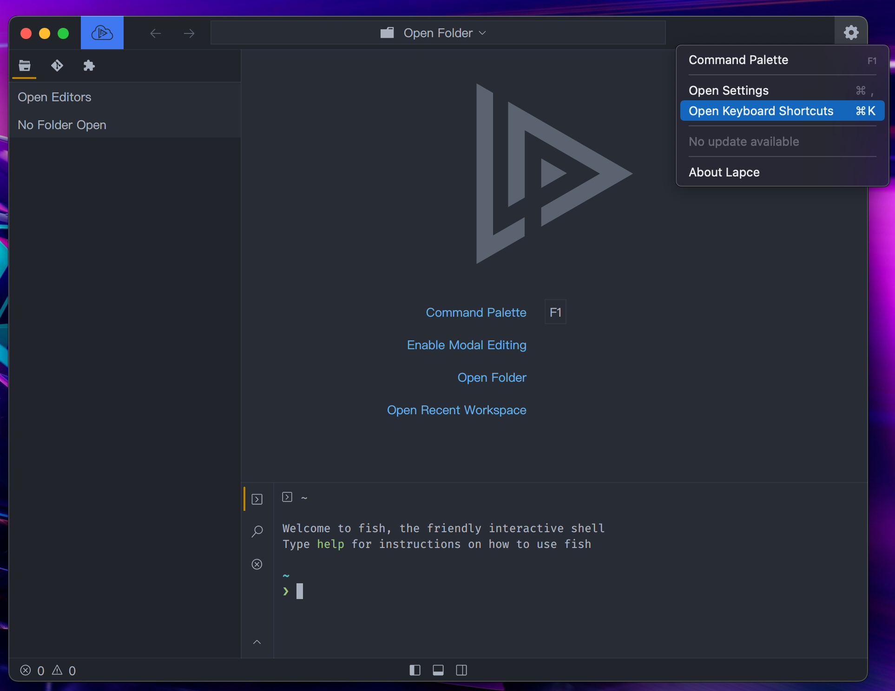
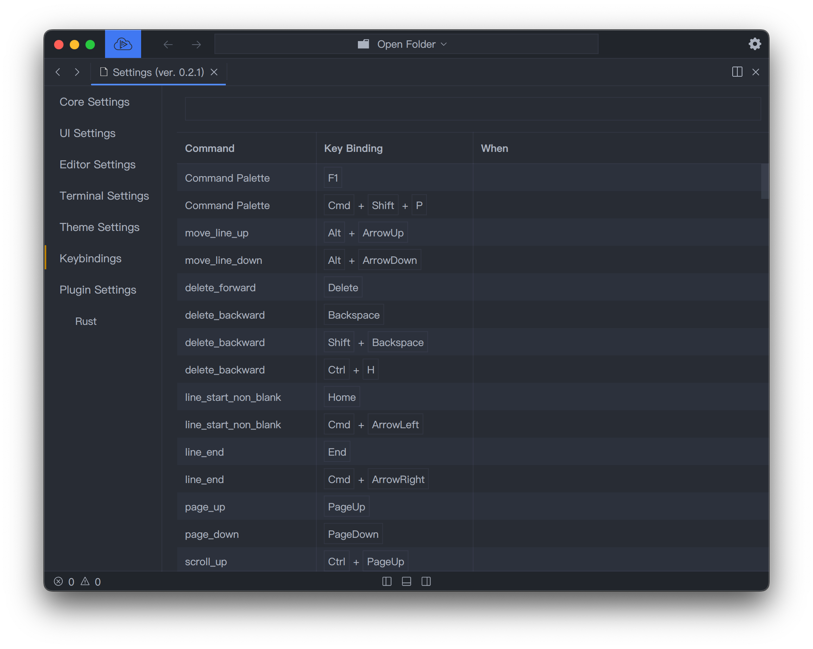

# Atajos de teclado

Para ver las combinaciones del teclados actuales y cambiarlos, haga click en el icono ajustes en la parte superior derecha y selcciona `Open Keyboard shortcuts`.

<figure><figcaption></figcaption></figure>

Ahora pdrá ver todos los comandos disponibles que puede combinar. Puede realizar un búsqueda aproximada por el cuadro de entrada. Haga click en la fila del comando que quiera añadir para cambiar una combinación de teclas. Tendra un cuadro emergente que muestra el nombre del comando. Simplemente escriba la clave que desea vincular el comando. Haga en `cancel` para canlelar el proceso o `save` para guardar la combinación de teclas. Para eliminar algún atajo de teclado, simplemente deje el cuadro emergente en blanco y haga click en `save`.

<figure><figcaption></figcaption></figure>
