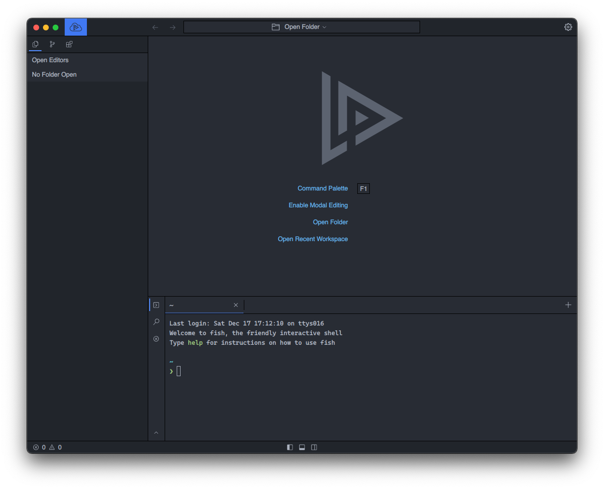
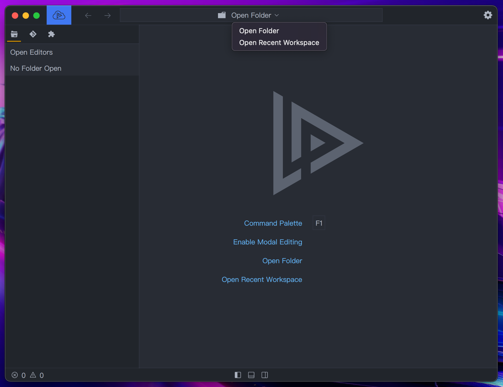
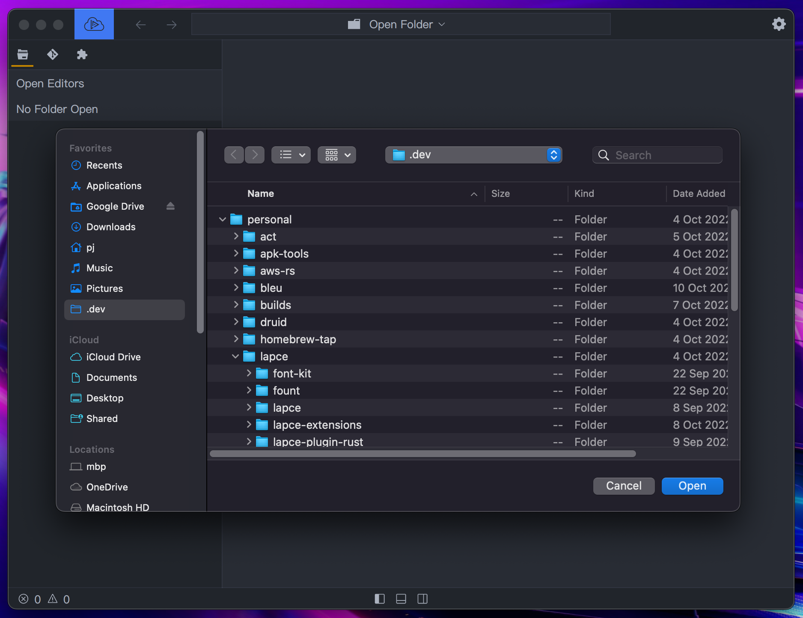
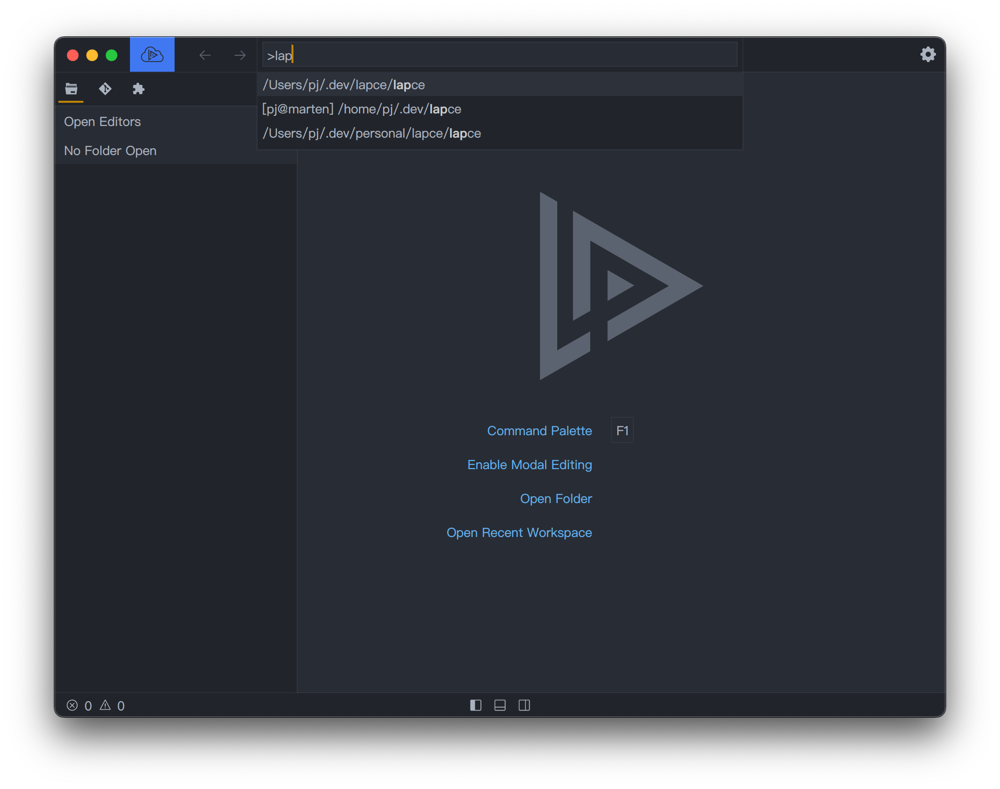
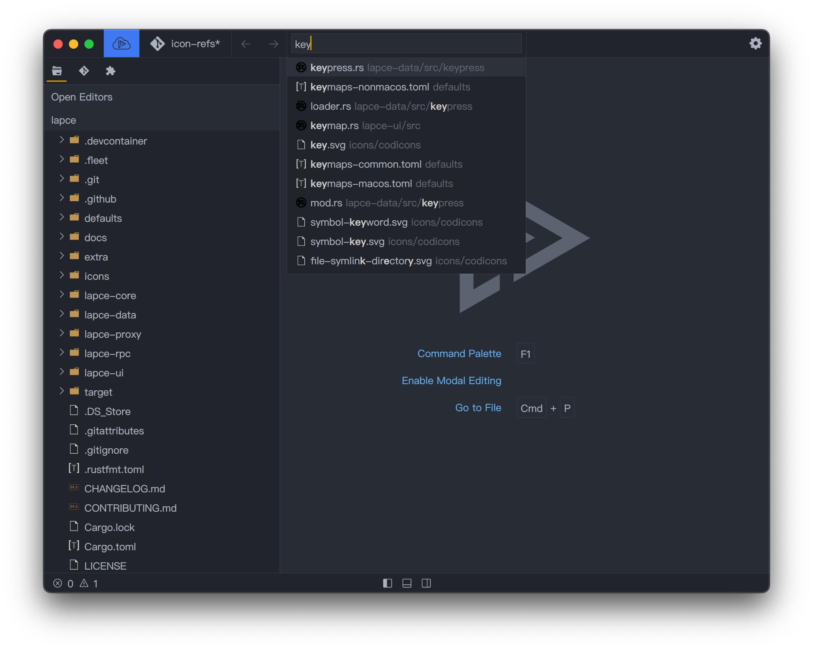

# Configuración

Lapce actualmente soporta Linux, Windows y macOs. Simplemente descargue [Lapce](https://lapce.dev/#downloads-all) para su sistema operativo e instálelo si es necesario.&#x20;

<figure><figcaption></figcaption></figure>

## Espacio de trabajo

Para comenzar a trabajar en su proyecto, la mejor manera es abrir la carpeta de su proyecto como un 
espacio de trabajo en Lapce. Haga click en el icono de la flecha hacia bajo junto a `Open Folder` en la parte superior. Abrirá el menú de su espacio de trabajo. Haga click en `Open Folder` en el menú desplegable

<figure><figcaption></figcaption></figure>

Luego elija la carpeta que desea, haga click en abrir (`Open`).

<figure><figcaption></figcaption></figure>

Alternativamente, también puede escoger `Open recent workspace` en el menú desplegable, en el que puede realizar una búsqueda aproximada de los espacios de trabajo que ha abierto antes.

<figure><figcaption></figcaption></figure>

## Trabajar con archivos

Despues de abrir un espacio de trabajo, los archivos aparecerán el explorador de archivos, en el panel izquierdo. Puede navegar por los archivos y carpetas, y abrirlos haciendo click en el nombre del archivo. Támbien, puede usar `Go To File` , o commandos como `Cmd`+`p` (en macOs) y `Ctrl`+`p` (en Linux y Windows)

<figure><figcaption></figcaption></figure>
