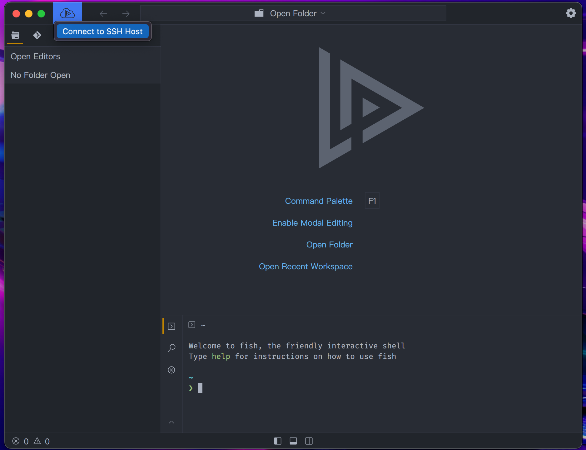
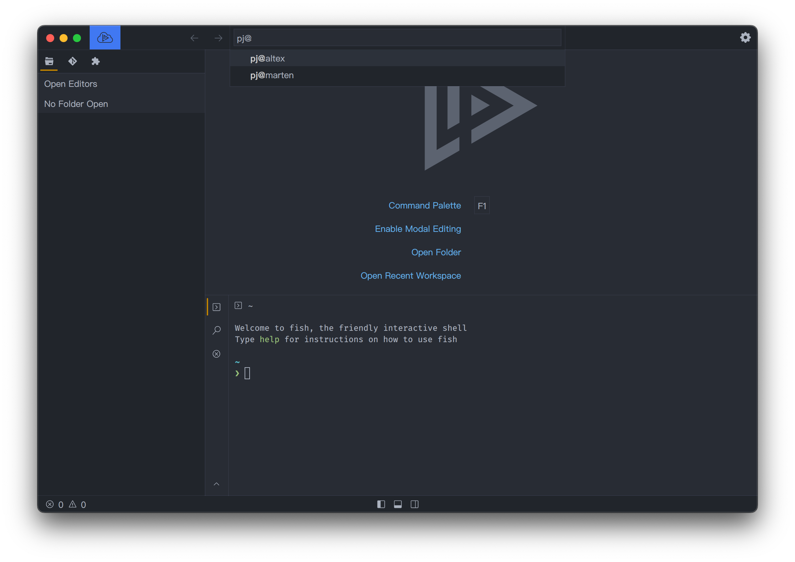
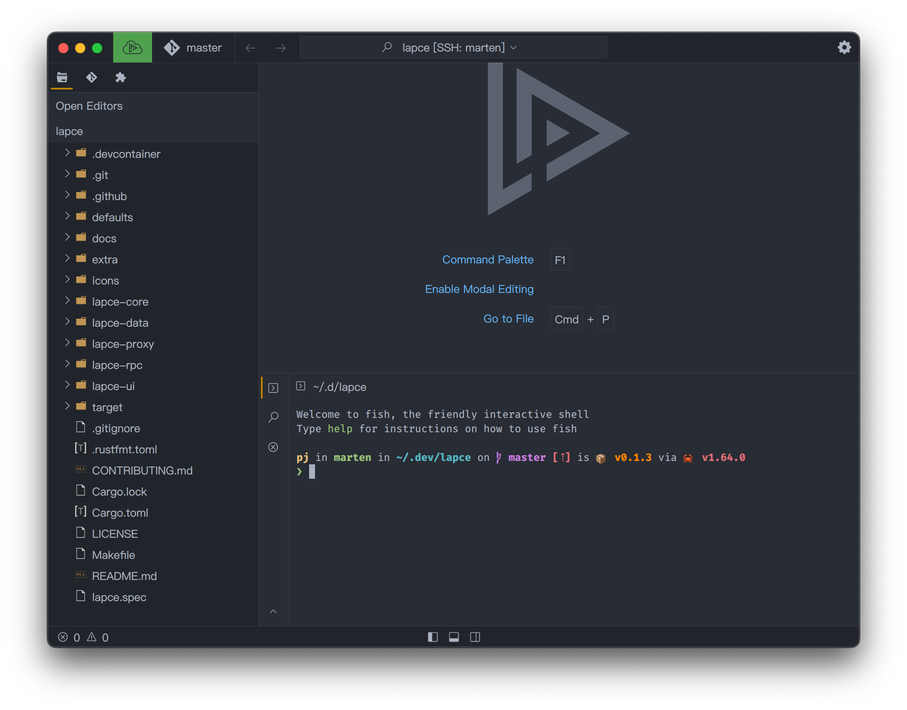

# Desarrollo remoto

Lapce tiene función de desarrollo remoto, que se puede conectar a una máquina remota a través de SSH. Despues de conectarse a la máquina remota, todos los plugins, y los comandos se ejecutarán desde la máquina remota. Tendrías exactamente la misma experiencia que si estuvieras trabajando en su espacio de trabajo local, sin sentir alguna diferencia.&#x20;

Para usarlo, haga click en el ícono azul del control remoto en la parte superior izquierda.

<figure><figcaption></figcaption></figure>

&#x20;Aparecerá el cuadro de entrada para que ingrese los detalles de la conexión SSH. Puede usar el nombre de host que configuró en su `~/.ssh/config`.

<figure><figcaption></figcaption></figure>

Despues de conectarse, mostrará un estado conectado verde en el ícono de desarrollo remoto. Luego puede abrir una carpeta `Open folder` como si estuviera abriendo una carpeta local.

<figure><figcaption></figcaption></figure>

<figure><figcaption></figcaption></figure>


El desarrollo remoto solo funciona con autenticación SSH basada en clave en este momento. Por lo que, no se conecta si normalmente coloca una contraseña para conectarse al host ssh.

