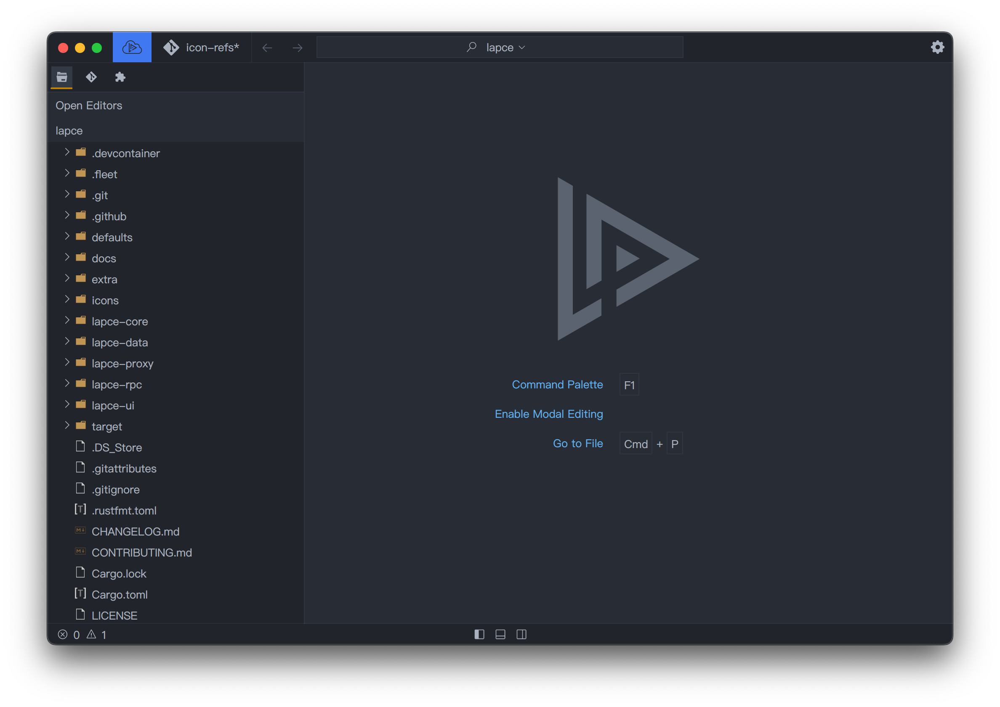
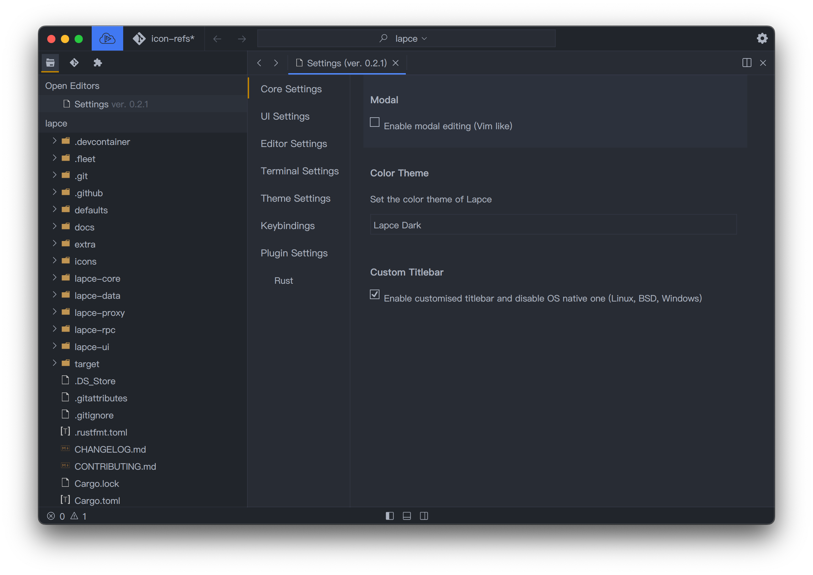
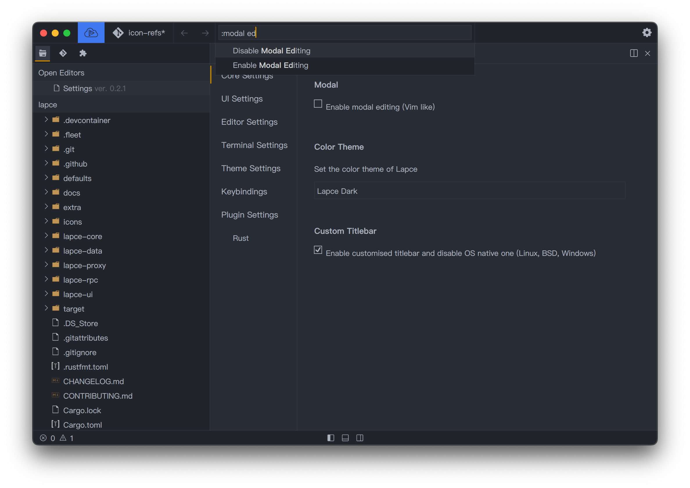

# Edición modal

Para usar la función de edición modal similar a Vim, primero deberá habilitar la edición modal en Lapce. Puede hacerlo haciendo click en `Enable modal editing` en la pantalla principal.

<figure><figcaption></figcaption></figure>

O actívelo/desactívelo en el panel [ajustes](ajustes.md).

<figure><figcaption></figcaption></figure>

O a traves de la [Paleta de Comandos](paleta-de-comandos.md)

<figure><figcaption></figcaption></figure>
