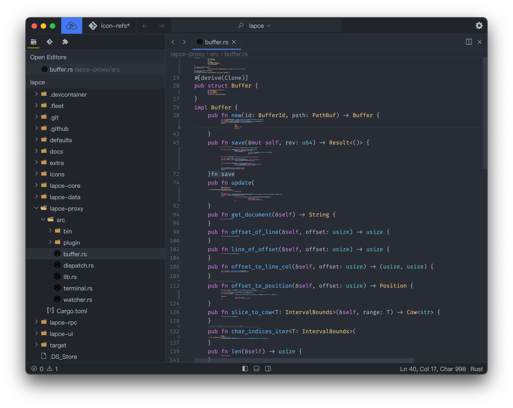

# Code Lens

> [!WARNING]
> Code Lens is currently available only in Lapce Druid (version: `<=0.2.8`).
> Lapce Floem (version: `>=0.3.0`) does not have Code Lens feature yet.

Lapce has a unique feature called Code Lens. It's a mixture of folding, minimap and code outline, with the content of functions rendered in very small fonts. You can toggle it by `Ctrl`+`e` in Windows and Linux, and `Cmd`+`e` in macOS. If you've got modal editing enabled, you can also use the spacebar to toggle it in Normal and Visual mode.

<figure><figcaption></figcaption></figure>

It's still a fully editable area that you can edit like a normal editor, with the benefit of easily shifting functions or structs/classes around the file.

You can also change the font size of Code Lens in [settings](../get-started/settings.md).
