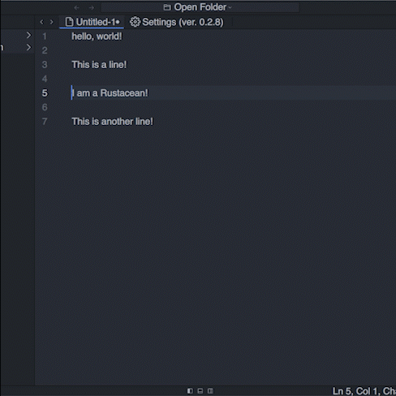
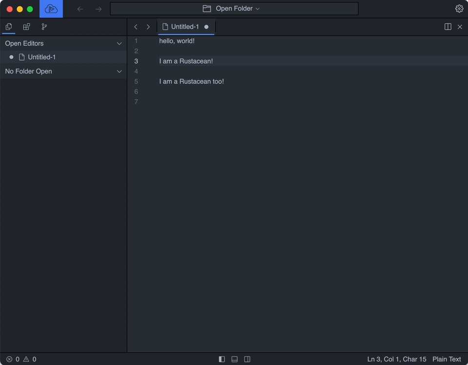
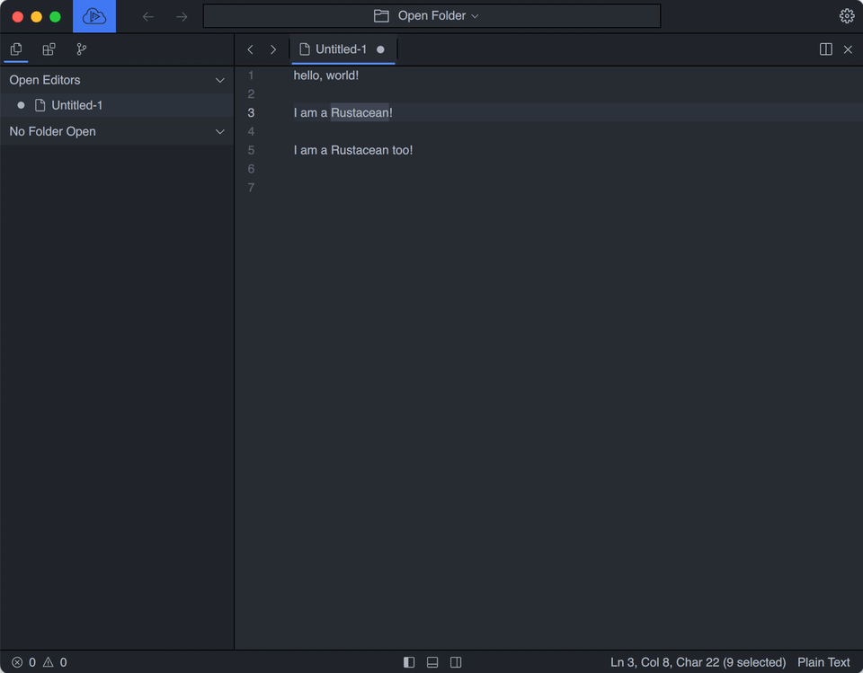
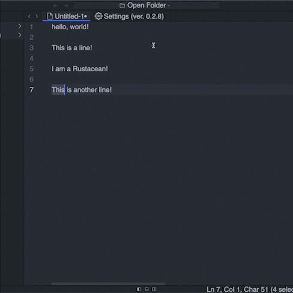

# Multiple Cursor

## Adding a line

To add the line above or below to the selection, use:

`Ctrl+Alt+ArrowUp` and `Ctrl+Alt+ArrowDown` For Windows and Linux

`Meta+Alt+ArrowUp` and `Meta+Alt+ArrowDown` For macOS

  
Demo

    <figure><figcaption></figcaption></figure>

## Insert cursors at end of line

To insert cursors at the end of a line of all current selections, use:

`Alt+Shift+I` For Windows and Linux and macOS

## Select current line

To select lines that  current cursors are at, use:

`Ctrl+L` For Windows and Linux

`Meta+L` For macOS

  
Demo

    <figure><figcaption></figcaption></figure>

## Select all occurrences at the cursor

To select all occurrences of the current selection, or the word the cursor at, use:

`Ctrl+Shift+L` For Windows and Linux

`Meta+Shift+L` For macOS

  
Demo

    <figure><figcaption></figcaption></figure>

## Add next occurrence

To add the next occurrence of the current selection, or the work the cursor at, use:

`Ctrl+D` For Windows and Linux

`Meta+D` For macOS

Or if you want to skip the next occurrence, use:

`Ctrl+K Ctrl+D` For Windows and Linux

`Meta+K Meta+D` For macOS

  
Demo

    <figure><figcaption></figcaption></figure>

## Undo cursor

To undo the last cursor action, use:

`Ctrl+U` For Windows and Linux

`Meta+U` For macOS

  
Demo

    <figure><figcaption></figcaption></figure>

