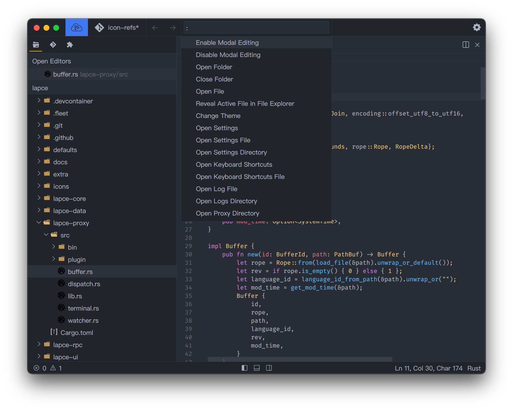

# Command Palette

Lapce has a command palette, which has got all the commands that Lapce provides with an easy to use fuzzy search which let you get the command you want quickly. To open it, press `Cmd`+`Shift`+`P` on macOS, or `Ctrl`+`Shift`+`P` on Linux and Windows.

<figure><figcaption></figcaption></figure>
