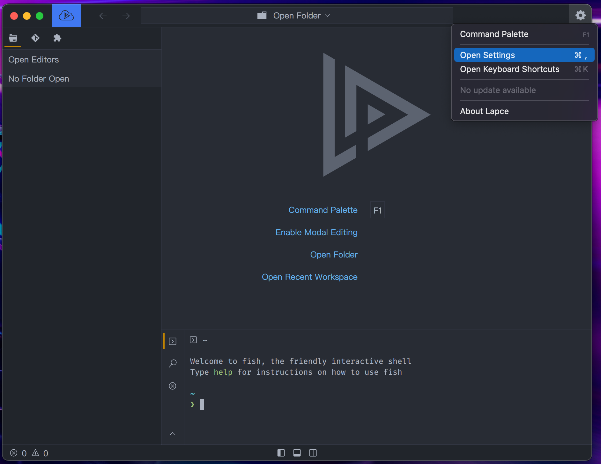

# Settings

To see the settings and change them in Lapce, click the gear icon on the top right to open the settings menu.

<figure><figcaption></figcaption></figure>

You can change font name, size, and all other settings in the core settings and editor settings in the settings panel.

<figure><figcaption></figcaption></figure>

