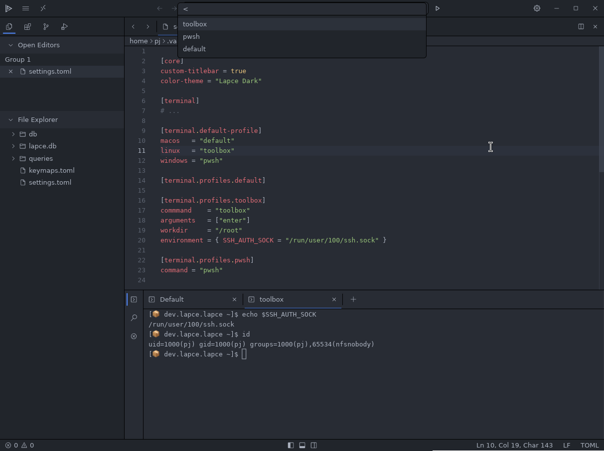

# Terminal

## Terminal profiles


Terminal profiles are experimental feature and not integrated completely with rest of the editor.


Example `settings.toml` configuration:

```toml
[terminal]
# ...

[terminal.default-profile]
macos   = "default"
linux   = "toolbox"
windows = "pwsh"

[terminal.profiles.default]

[terminal.profiles.toolbox]
command     = "toolbox"
arguments   = ["enter"]
workdir     = "/root"
environment = { SSH_AUTH_SOCK = "/run/user/100/ssh.sock" }

[terminal.profiles.pwsh]
command = "pwsh"
```

Profiles can be launched via palette using a `<` prefix

<figure><figcaption></figcaption></figure>
