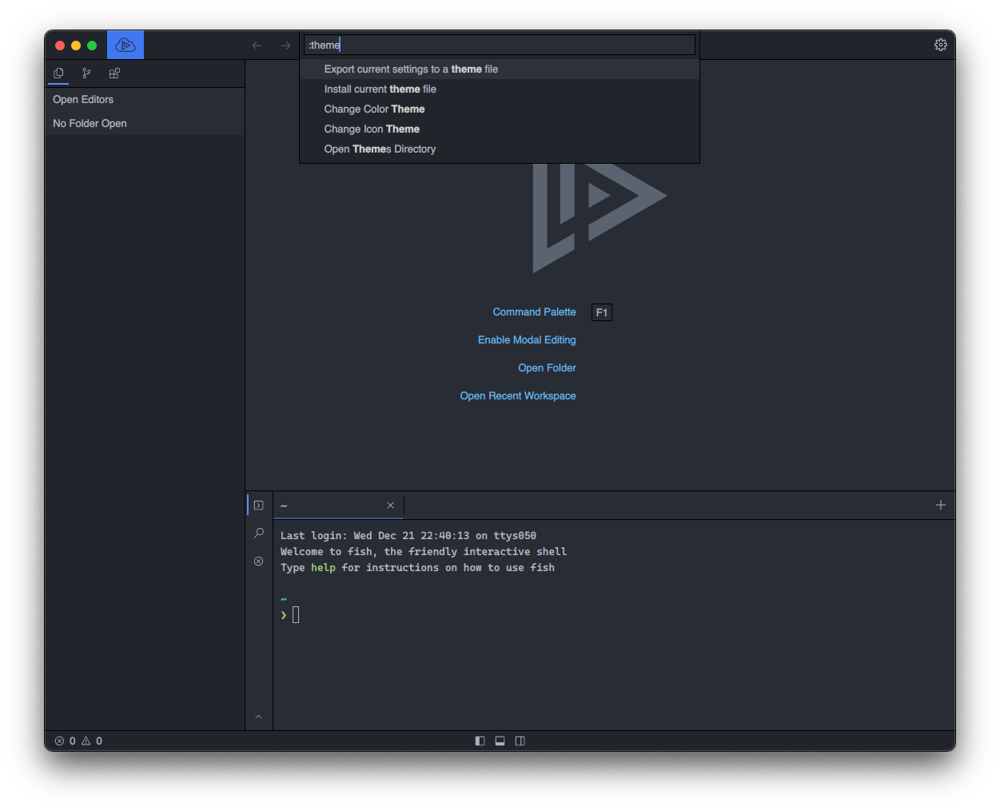
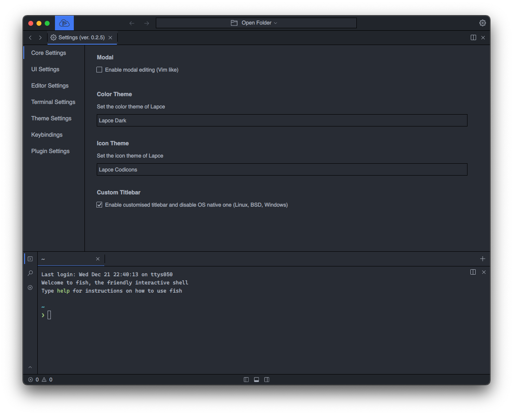
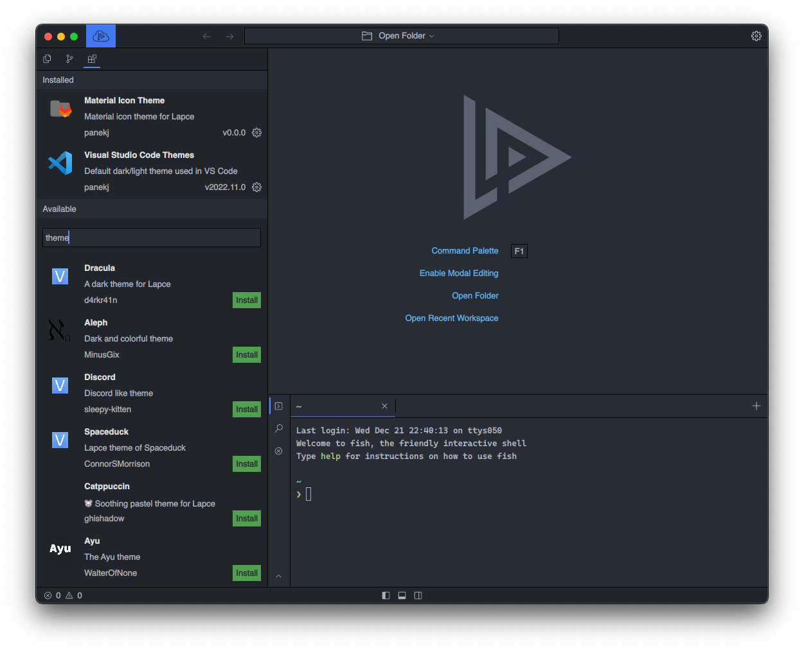
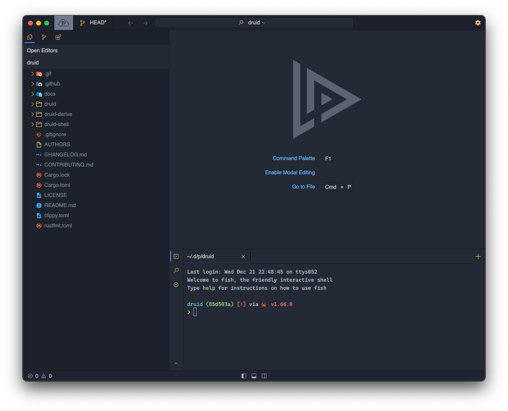

# Themes

You can customise how Lapce looks via Colour Themes and Icon Themes either via [Command Palette](command-palette.md)

<figure><figcaption></figcaption></figure>

or via [Core Settings](settings.md)

<figure><figcaption></figcaption></figure>

## Installing themes 

Themes can be installed just like other extensions from the extensions tab

<figure><figcaption></figcaption></figure>

---

*Lapce with [`Ayu Mirage`](https://plugins.lapce.dev/plugins/WalterOfNone/ayu) and [`Material Icons`](#)*

<figure><figcaption></figcaption></figure>
